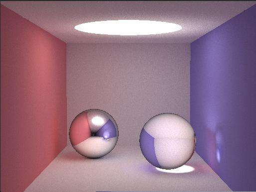
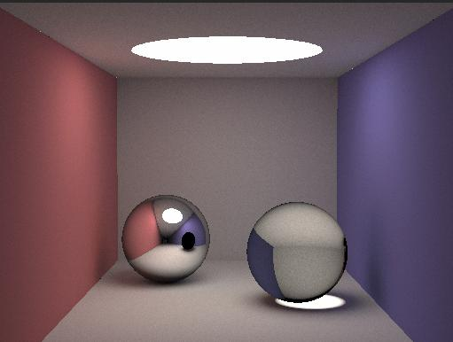
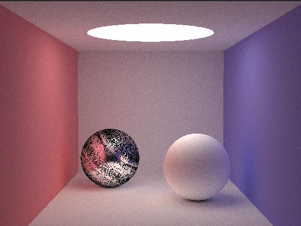
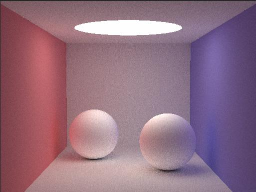
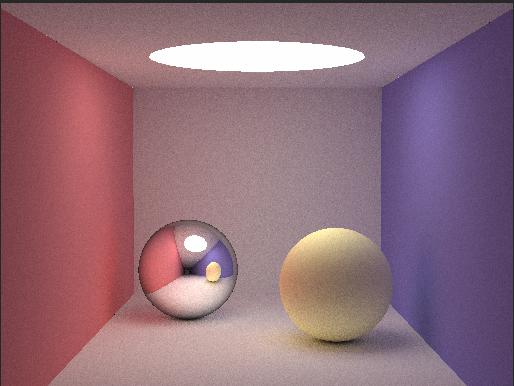

# Cuda
This project is a GPU path ray tracer.

The full CPU version of smallpt can be found at http://www.kevinbeason.com/smallpt/.

Some modifications:
1.CPU version of ray tracer uses recursion but CUDA device can not handle recursion well and parallelism works better for iteration.
  Thus, I change the radiance function from recursion to iteration.
  
  Result of 4 loops:
  
  
  
  Result of 8 loops:
  
  
  
  Result of > 8 loops: completely black
  
2.Need to add a small offset in the ray origin each time to avoid self intersection.

  Otherwise, it will be:
  
  
  
3.Result for diffuse:

  
  
4. Result for specular:

 
